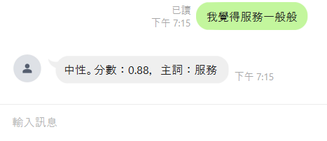

說明：
在原本上課教的程式碼中async function MS_TextSentimentAnalysis()的function加上

const sentimentScore = results[0].confidenceScores[results[0].sentiment];
定義常數"評論分數"

const sentimentText = results[0].sentiment === "positive" ? "正向" :
                      results[0].sentiment === "negative" ? "負向" :
                      "中性";
定義常數"中文評價(正向、負向、中性)"
    
const mainOpinions = results[0].sentences[0].opinions[0].target.text;
定義常數"主詞"

const echo = {
    type: 'text',
    text: `${sentimentText}。分數：${sentimentScore.toFixed(2)}，主詞：${mainOpinions}`
};
這段是回覆的程式
text:` `裡的就是回傳的句子，分別是剛剛定義的常數"中文評價"。分數：常數"評論分數"，主詞：常數"主詞"
    
    
因此圖片為我傳了【我覺得服務一般般】，它回傳了【中性。分數：0.88，主詞：服務】
