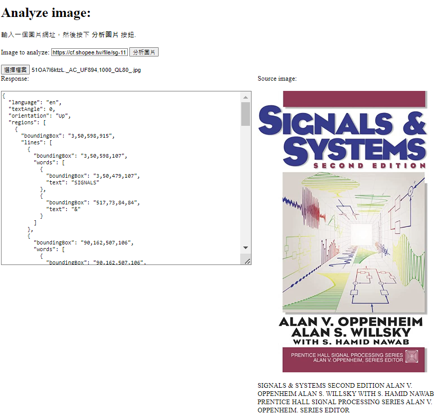
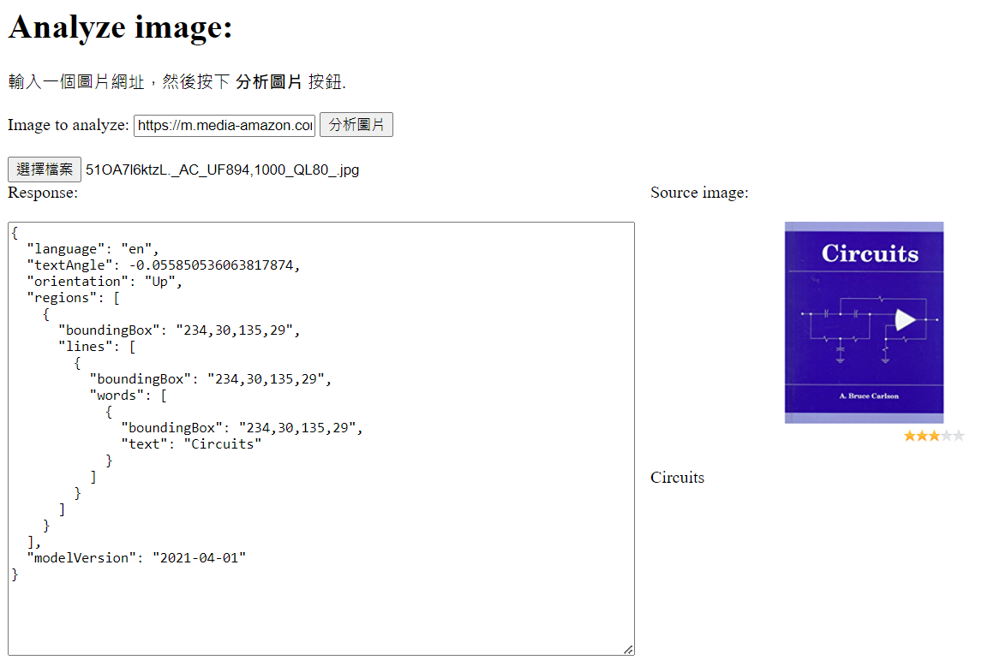

構思：

去圖書館或書店的時候，找到一本書，想要快速知道裡面的資訊，可以透過電腦視覺的文字辨識，將封面的圖拿去掃描

回傳封面文字，可以連結館藏資料庫，利用回傳值搜尋

如下圖所示

此為用檔案上傳的方式

此為網址搜尋的方式

只是目前只能做到回傳文字，而且是圖片上的所有文字，未來有機會可改善成自動辨識出關鍵字，並搜尋

    

程式碼說明：
在原本上課教的程式碼中改成使用v3.2版的OCR

變更參數

    var params = {
        "language": "en",
        "detectOrientation": "true"
    };

在.done(function (data){}中加上

    // 提取識别到的文字
    var extractedText = extractTextFromOCRResult(data);
    $("#bookText").text(extractedText);

最後加上function extractTextFromOCRResult

    // 从OCR结果中提取文字
    function extractTextFromOCRResult(ocrResult) {
        var extractedText = "";
            if (ocrResult && ocrResult.regions && ocrResult.regions.length > 0) {
                for (var i = 0; i < ocrResult.regions.length; i++) {
                    var region = ocrResult.regions[i];
                    if (region.lines && region.lines.length > 0) {
                        for (var j = 0; j < region.lines.length; j++) {
                            var line = region.lines[j];
                            if (line.words && line.words.length > 0) {
                                for (var k = 0; k < line.words.length; k++) {
                                    var word = line.words[k];
                                    extractedText += word.text + " ";
                                }
                             }
                         }
                     }
                 }
             }
             return extractedText.trim();
    }
       
另外原本的index.html中

在

    

後加上一個變數

    

